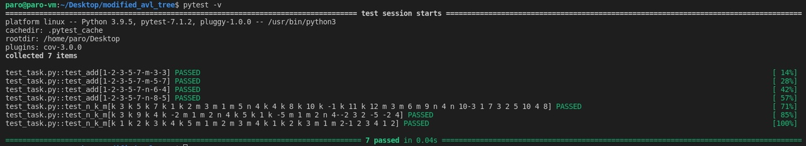
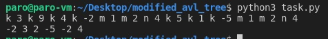
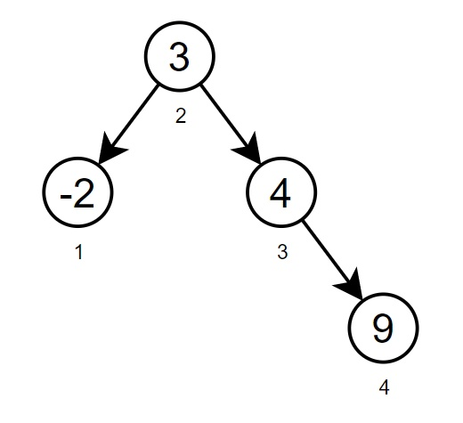
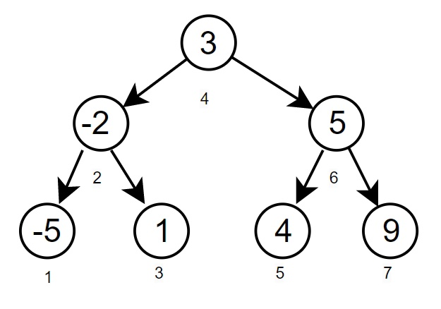

# Tools Intern Developer Task
---
Задача реализована на основе АВЛ-дерева. Для реализации m-, n- запросов за log(n) была введена дополнительная характеристика size класса Node - размер поддерева. 

## Запуск
Для запуска в консоль вводится команда:
```
python3 task.py
```
Далее вводитя набор данных в виде строки, можно использовать только символы k, m, n и целые числа. Пробелы должны быть между символом [mnk] и числом. В конце ввода данных пробел __не__ нужен. 
Результатом будет строка из чисел - ответы на m-, n- запросы.
## Возможные ошибки ввода
Для проверки корректности вводных данных спользуется регулярное выражение. Оно имеет вид ``` '[mnk]\s[-]?\d+)\s)*[mnk]\s[-]?\d+' ``` и позволяет обнаружить ошибки ввода. 

неправильный ввод | ошибка | правильный ввод
:-----------------|:-------|:---------------
```k4 k5 k6 m4```| отсутвует пробелы между символами| ```k 4 k 5 k 6 m 4```
```k 4 k 5 k 6 l 4``` |недопустимый символ l| ```k 4 k 5 k 6 n 4```
```5 k 4 k 6 k 4 n ```| неверный порядок, сначала идет буквенный символ | ```k 5 k 4 k 6 n 4```

* Может возникнуть логическая ошибка на m-запросе. Когда пользователь попытается найти отрицательный по счету элемент(к примеры (-1)ый) или когда количество элементов в дереве меньше заданного пользователем(в дереве 5 элементов, а пользователь запрашивает m = 7). Для этого в m-request стоит ```except AttributeError``` и выводится сообщение об ошибке. 

## Тестирование
Тестирование было выполнено при помощи библиотеки pytest. Ее можно установить при помощи команды в терминал (для Linux):
``` 
pip install -U pytest 
```
Для запуска тестов в консоль вводится команда: 
```
pytest -v
```
Результат выполнения тестов:
---


## Конструктор, деструктор
Дерево можно создать передав данные при его инициализации:
``` Tree = AVL_tree(1,2,3,4) ```
Реализуется это при помощи метода ```__init()__```.
Деструктор реализуется при помощи метода ``` __del__() ```.
## Итератор 
Благодаря методу ```__iter__()```  класс становится итерируемым объектом. Что позволяет использовать следующий синтаксис для обхода дерева, где ```Tree``` экземпляр класса ```AVL_tree()```: 
```
for i in Tree:
    print(i)
```

## Пример работы программного кода

---
Входной набор ```k 3 k 9 k 4 k -2 m 1 m 2 n 4 ||| k 5 k 1 k -5 m 1 m 2 n 4```  можно разделить на 2 части
Первая часть это дерево:
---

---
Соответсвенно 1-ый элемент это -2, второй 3 и количество элементов меньших 4 это 2. 
При добавлении еще трех вершин, дерево преобретет следующий вид:
---

---
И соответственно первый элемент будет -5, второй -2 и количество элементов меньших 4 изменится на 3.
Что и соответствует выводу ``` -2 3 2 -5 -2 4 ```


